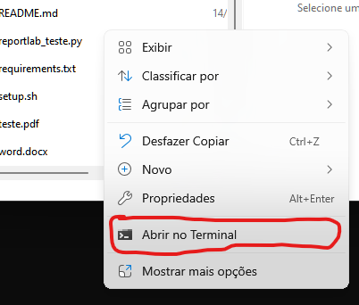

# pdf_to_print
Lê dados no arquivo em .pdf e imprime na declaração
## Uso
-  instale as dependências do *requirements.txt*</br>
No Win11, vá até a pasta do programa e com o botão direito do mouse, clique na opção *Abrir no terminal* e cole o comando abaixo.



```markdown
pip instal -r .\requirements.txt
```

* após a instalação das dependencias, rode o comando:
```
    python .\print_termo_kit_higiene.py
```
#### Situações especiais do arquivo .pdf a ser lido
Possui várias tabelas, sendo a 1° cabeçalho (lixo), possui uma única coluna com diversas ou únicas linhas e várias informações dentro da linha, das quais apenas desejo duas delas.

* Gerar um relatório no __IPEN__, na secção 1.8 e escolha a opcção de ordenação por __NOMES__.
* Salvar este arquivo na pasta __Plantão/Para Impressão do termo de recebimento__.
* Os arquivos gerados serão impressos automaticamente.

* Precisa ter o java instalado.


## Funcionalidades
- [x] Lê arquivo .pdf <br>
- [x] Termo de entrega <br>
- [x] Limpas as tabelas.<br>
- [ ] Uso de NPL (spacy) <br>
- [x] Gera os termos de compromissos de cada um e salva em uma pasta com .pdf.<br>
- [ ] Imprime na impressora em folha usada.<br>

### Algumas referências consultadas

[manipulando-arquivos-pdf-com-python](https://pythonacademy.com.br/blog/manipulando-arquivos-pdf-com-python) <br>
[Como Imprimir Arquivos Automaticamente com Python](https://www.youtube.com/watch?v=EQlXQsYeoUI)<br>
[Como Ler Arquivo PDF, Como Mesclar (merge) arquivos PDF, PDF para Texto com Python , PyPDF2](https://www.youtube.com/watch?v=MRmqMRLleK4) <br>
[Documentação PyPDF2](https://pypdf2.readthedocs.io/en/3.0.0/user/forms.html) <br>
[medium gera pdf](https://medium.com/@habbema/criando-arquivos-pdf-com-python-0eb5229c4a70) <br>
[usandopy](https://www.usandopy.com/pt/artigo/reportlab-em-python-como-criar-documentos-pdf-personalizado-em-python-automacao-em-python/) <br>
[para consultar a biblioteca PDFMiner](https://www.brasilcode.com.br/15-pacotes-python-para-automacao/)<br>

https://www.youtube.com/watch?v=JQoPGhVVPJk <br>

camelot <br>

[extrai e concatena](https://www.youtube.com/watch?v=S_tH-wtXoN4) <br>
[Estrutura de tabelas lidas](https://medium.com/@pymupdf/table-recognition-and-extraction-with-pymupdf-54e54b40b760) <br>
[Extração com __OCR__](https://medium.com/@dr.booma19/extracting-text-from-pdf-files-using-ocr-a-step-by-step-guide-with-python-code-becf221529ef) <br>
[DADOS NULOS](https://www.youtube.com/watch?v=k1zi4EwIXoc&list=PLyqOvdQmGdTR46HUxDA6Ymv4DGsIjvTQ-&index=23)<br>


#### Instalar modulos no interpretador expecifico

```
C:/Users/AULA-1/.conda/envs/applications-with-kivy-in-python/python.exe -m pip install JPype1
```